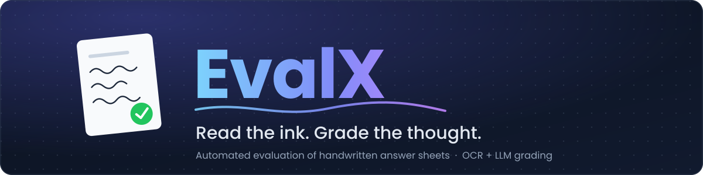
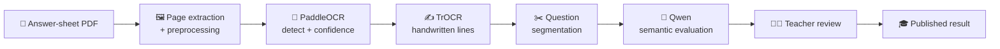

<p align="center">
  
</p>

<p align="center">
  
  
  
  
  
  
</p>

**EvalX turns stacks of handwritten answer sheets into reviewed, explainable scores, in minutes instead of days.**

<br/>
<div align="center">


[**The Idea**](#-the-idea) · [**How It Thinks**](#-how-it-thinks) · [**Architecture**](#-architecture) · [**Quick Start**](#-quick-start) · [**API**](#-api-reference) · [**Roadmap**](#-honest-limitations--roadmap)


</div>


---

## 💡 The Idea

Grading handwritten exams is slow, repetitive, and inconsistent. EvalX handles the heavy lifting and keeps the teacher in charge:

> 📄 **Upload a PDF** → 👁️ **Machines read the handwriting** → 🧠 **An LLM judges meaning, not keywords** → 👩‍🏫 **The teacher reviews, overrides, and publishes** → 🎓 **Students see their results**

| Who | What they get |
|---|---|
| 👩‍🏫 **Teachers** | Create exams, upload answer sheets, review AI scores and feedback, override marks, publish, retry, delete |
| 🎓 **Students** | A private portal with published results and an exam percentage graph |
| 🛡️ **Admins** | Teacher and student account management plus dashboard statistics |

---

## ✨ Feature Highlights

- 📝 **Exam builder**: questions, reference answers, and marks per question
- 📑 **PDF answer-sheet upload** with page extraction and image preprocessing
- 🔍 **Dual-engine OCR**: PaddleOCR finds and reads text, TrOCR handles handwritten lines
- 📊 **OCR confidence scoring** at answer level and submission level
- 🧠 **Qwen-powered semantic grading**: correctness, completeness, relevance, marks, written feedback
- ✏️ **Human in the loop**: score overrides, publishing, retry, deletion
- 📈 **Student result portal** with a performance graph
- 🔐 **Role-based auth** for admin, teacher, and student

---

## 🧬 How It Thinks



Each answer is scored on three axes before marks are computed:

| Signal | Meaning |
|---|---|
| **Correctness** | Is what the student wrote actually right? |
| **Completeness** | Did they cover everything the reference answer expects? |
| **Relevance** | Did they stay on the question? |

> 💬 OCR confidence (how well the machine *read* the handwriting) is deliberately kept separate from Qwen's evaluation (how well the student *answered*), so a messy scrawl never gets confused with a wrong answer.

---

## 🏗️ Architecture

```text
┌──────────────────────────┐
│  Frontend (React + Vite) │
└────────────┬─────────────┘
             │  HTTP / JSON / multipart PDF
             ▼
┌──────────────────────────┐
│ Backend (Node + Express) │──────────▶  🗄️ MongoDB
│  REST API + coordinator  │             exams · questions · submissions
└──────┬──────────────┬────┘             answers · evaluations
       │              │
       ▼              ▼
┌─────────────┐  ┌─────────────┐
│ 👁️ OCR      │  │ 🧠 Qwen     │
│ PaddleOCR   │  │ semantic    │
│ + TrOCR     │  │ evaluation  │
└─────────────┘  └─────────────┘
```

| Service | Directory | Default URL | Purpose |
|---|---|---:|---|
| 🖥️ Frontend | `frontend/` | `http://localhost:5173` | React web application |
| ⚙️ Backend | `backend/` | `http://localhost:5000` | REST API and evaluation coordinator |
| 👁️ OCR | `ocr-service/` | `http://localhost:8001` | PDF preprocessing and OCR |
| 🧠 Qwen | `qwen-service/` | `http://localhost:8002` | AI answer evaluation |
| 🗄️ MongoDB | Local or remote | `mongodb://127.0.0.1:27017` | Persistent application data |

<details>
<summary><b>📁 Project structure</b></summary>

```text
backend/
  src/
    config/          Database and environment configuration
    controllers/     HTTP request handlers
    middleware/      Upload and authentication middleware
    models/          Mongoose models
    routes/          Express routes
    services/        OCR, Qwen, exam, submission, and evaluation logic
    utils/           Response and scoring helpers

frontend/
  src/
    components/      Shared UI components
    pages/           Landing, login, admin, teacher, and student pages
    services/api.js  Backend API client

ocr-service/
  app/
    main.py          FastAPI entrypoint
    ocr.py           PaddleOCR setup
    trocr.py         TrOCR handwritten recognition
    preprocessing/   PDF extraction and image preprocessing
  postprocessing/    OCR normalization and question segmentation
  tests/             OCR and preprocessing tests

qwen-service/
  app/
    main.py          FastAPI entrypoint
    evaluator.py     Prompting, parsing, validation, and scoring
    model.py         Local Qwen model loading and generation
    schemas.py       Request and response schemas
  models/            Downloaded Qwen model files
  tests/             Evaluation tests
```

</details>

---

## 🚀 Quick Start

### 🧰 You'll need

- Windows, macOS, or Linux
- Node.js 18+ and npm
- Python 3.10+
- MongoDB (local or remote)
- Disk space for PaddleOCR, TrOCR, and Qwen model files
- *Optional:* NVIDIA GPU with CUDA/PyTorch

> ⏳ The first run may download or initialize large model files. CPU inference works but is considerably slower than GPU.

### 🪜 Setup in 6 steps

<details open>
<summary><b>1️⃣ Start MongoDB</b></summary>

Start MongoDB using the method appropriate for your installation. The default connection is:

```text
mongodb://127.0.0.1:27017/sih-evaluation
```

</details>

<details>
<summary><b>2️⃣ Configure the backend</b></summary>

Create `backend/.env` from `backend/.env.example`:

```env
PORT=5000
MONGO_URI=mongodb://127.0.0.1:27017/sih-evaluation
MAX_FILE_SIZE_MB=15
UPLOAD_DIR=uploads
OCR_SERVICE_URL=http://localhost:8001
OCR_TIMEOUT_MS=120000
QWEN_SERVICE_URL=http://localhost:8002
QWEN_TIMEOUT_MS=120000
AUTH_SECRET=replace-with-a-long-random-secret
TEACHER_ID=TCH001
TEACHER_PASSWORD=demo123
```

> 🔑 Use a long random value for `AUTH_SECRET` outside local development.

</details>

<details>
<summary><b>3️⃣ Install backend dependencies</b></summary>

```powershell
cd backend
npm install
```

</details>

<details>
<summary><b>4️⃣ Configure and install the frontend</b></summary>

Create `frontend/.env` from `frontend/.env.example`:

```env
VITE_API_URL=http://localhost:5000/api
```

```powershell
cd frontend
npm install
```

</details>

<details>
<summary><b>5️⃣ Set up the OCR service</b></summary>

```powershell
cd ocr-service
python -m venv .venv
.\.venv\Scripts\Activate.ps1
pip install -r requirements.txt
```

If PowerShell blocks activation, run the service with the virtual-environment executable directly:

```powershell
.\.venv\Scripts\python.exe -m uvicorn app.main:app --host 0.0.0.0 --port 8001
```

</details>

<details>
<summary><b>6️⃣ Set up the Qwen service</b></summary>

```powershell
cd qwen-service
python -m venv .venv
.\.venv\Scripts\Activate.ps1
pip install -r requirements.txt
```

The Qwen service requires the model files under `qwen-service/models/`. If the model is not present, configure or download the model according to `qwen-service/app/model.py`.

</details>

### ▶️ Launch everything

Run each service in its own terminal.

| # | Service | Commands | Health check |
|:-:|---|---|---|
| 1 | 👁️ **OCR** | `cd ocr-service`<br/>`.\.venv\Scripts\Activate.ps1`<br/>`uvicorn app.main:app --host 0.0.0.0 --port 8001` | `http://localhost:8001/health` |
| 2 | 🧠 **Qwen** | `cd qwen-service`<br/>`.\.venv\Scripts\Activate.ps1`<br/>`uvicorn app.main:app --host 0.0.0.0 --port 8002` | `http://localhost:8002/health` |
| 3 | ⚙️ **Backend** | `cd backend`<br/>`npm start` (or `npm run dev` for auto-restart) | `http://localhost:5000/api/health` |
| 4 | 🖥️ **Frontend** | `cd frontend`<br/>`npm run dev` | Open `http://localhost:5173` |

---

## 🔑 Demo Credentials

| Role | Login | Password |
|---|---|---|
| 👩‍🏫 Teacher | `TCH001` | `demo123` |
| 🛡️ Admin | `admin` | `admin123` |
| 🎓 Student | Registered roll number (e.g. `2024CSE1021`) | none, roll-based |

> The admin login uses an admin record stored in MongoDB, so the seed script or existing database setup must create the account. Student accounts are created from the admin portal.
>
> ⚠️ **Change all demo credentials before deployment.**

---

## 🗺️ The Main Workflow

```text
 🛡️ ADMIN                 👩‍🏫 TEACHER                          🎓 STUDENT
    │                          │                                  │
    ├─ create teacher &        │                                  │
    │  student accounts        │                                  │
    │                          ├─ create exam                     │
    │                          │  (questions + answers + marks)   │
    │                          ├─ upload PDF for a student        │
    │                          │        │                         │
    │                          │        ▼                         │
    │                          │   OCR ▸ Qwen evaluation          │
    │                          │        │                         │
    │                          ├─ review / edit marks             │
    │                          ├─ publish ───────────────────────▶├─ view result
    │                          │                                  │  + performance graph
```

1. Log in as an admin and create teacher and student accounts.
2. Log in as a teacher.
3. Open **Examinations** and create an examination.
4. Add at least one question, reference answer, and positive maximum mark.
5. Open **Upload Paper** and select the examination and student.
6. Upload a PDF answer sheet.
7. The backend sends the PDF to the OCR service.
8. OCR preprocesses pages, detects text regions, measures PaddleOCR confidence, and uses TrOCR for handwritten text.
9. The backend sends each extracted answer to the Qwen service.
10. Qwen evaluates correctness, completeness, relevance, marks, and feedback.
11. The teacher reviews the result and optionally edits marks.
12. The teacher publishes the result.
13. The student logs in and views the published result and exam performance graph.

---

## 📡 API Reference

All backend routes are prefixed with `/api`. Authenticated requests use:

```http
Authorization: Bearer <token>
```

<details>
<summary><b>🔐 Authentication</b></summary>

```http
POST /api/auth/login
POST /api/admin/login
```

Teacher request:

```json
{
  "role": "teacher",
  "teacherId": "TCH001",
  "password": "demo123"
}
```

Student request:

```json
{
  "role": "student",
  "roll": "2024CSE1021"
}
```

</details>

<details>
<summary><b>📝 Exams</b></summary>

```http
GET    /api/exams
GET    /api/exams/:id
POST   /api/exams
DELETE /api/exams/:id
```

Create-exam request:

```json
{
  "title": "Data Structures Mid-Term",
  "subject": "Data Structures",
  "questions": [
    {
      "questionText": "Explain binary search.",
      "answerKey": "Binary search repeatedly divides a sorted search interval in half.",
      "maxMarks": 10
    }
  ]
}
```

</details>

<details>
<summary><b>📄 Submissions</b></summary>

```http
POST   /api/submissions
GET    /api/submissions
GET    /api/submissions/:id
POST   /api/submissions/:id/retry
DELETE /api/submissions/:id
PATCH  /api/submissions/:id/publish
PATCH  /api/submissions/:submissionId/score
```

Upload as multipart form data with `examId`, `studentRoll`, and `file`.

Retry is available for failed or completed submissions. It clears previous answer/evaluation records and reruns OCR and AI evaluation.

</details>

<details>
<summary><b>🎓 Results</b></summary>

```http
GET /api/results/:submissionId
GET /api/results/student/:roll
```

Student result access is restricted to the authenticated student's own roll number.

</details>

<details>
<summary><b>👁️ OCR service</b></summary>

```http
GET  /health
POST /api/ocr
```

The response includes answer-level and submission-level OCR confidence:

```json
{
  "submissionId": "answer-sheet",
  "ocrConfidence": 82,
  "answers": [
    {
      "questionNumber": 1,
      "questionText": "Q1 Explain binary search",
      "answerText": "...",
      "ocrConfidence": 82,
      "lineRange": { "start": 0, "end": 4 },
      "page": 1
    }
  ]
}
```

OCR confidence is derived from PaddleOCR recognition scores. It is separate from Qwen's semantic evaluation and marks.

</details>

<details>
<summary><b>🧠 Qwen service</b></summary>

```http
GET  /health
POST /evaluate
POST /api/evaluate
```

Request:

```json
{
  "question": "Explain binary search.",
  "answer_key": "Binary search repeatedly divides a sorted search interval in half.",
  "student_answer": "Binary search divides the sorted list into halves.",
  "max_marks": 10
}
```

Response:

```json
{
  "correctness": 0.9,
  "completeness": 0.8,
  "relevance": 1.0,
  "score": 8.75,
  "feedback": "The answer is correct but could explain the process in more detail."
}
```

</details>

---

## 🛂 Authorization Rules

| Role | Can do |
|---|---|
| 🚫 **Anonymous** | Nothing: portals and protected API routes require login |
| 👩‍🏫 **Teacher** | Create exams, upload submissions, review scores, publish, retry, delete exams and submissions |
| 🛡️ **Admin** | Manage teacher/student accounts, read dashboard exam and submission statistics |
| 🎓 **Student** | View only their own *published* results |

> 🗑️ Deleting an exam cascades to its questions, submissions, answers, evaluations, and uploaded files.

---

## 🧪 Testing & Validation

```powershell
# Frontend build
cd frontend
npm run build

# Backend syntax checks
cd backend
node --check src/server.js
node --check src/services/ocr.service.js
node --check src/services/qwen.service.js

# OCR tests (from ocr-service)
python -m pytest tests

# Qwen tests (from qwen-service)
python -m pytest tests
```

Some files under `ocr-service/tests/` are executable scripts rather than pytest modules. Run them directly when appropriate:

```powershell
python -m tests.test_pipeline
python -m tests.test_ocr
```

---

## 🔒 Security Notes

- [ ] Change demo credentials before deployment
- [ ] Use a strong random `AUTH_SECRET`
- [ ] Never commit `.env` files or credentials
- [ ] Hash passwords before using this outside a demo (local accounts currently store them directly for simplicity)
- [ ] Restrict CORS to the deployed frontend origin
- [ ] Add rate limiting and file scanning before exposing uploads publicly

---

## 🧭 Honest Limitations & Roadmap

What EvalX doesn't do *yet*, stated plainly:

| Limitation | Natural next step |
|---|---|
| Student login is roll-based, not password-based | Add password or OTP authentication |
| Teacher credentials come from env vars unless managed via the admin flow | Move fully to admin-managed accounts |
| Question segmentation relies on markers like `Q1`, `1.`, or `Question 1` | Layout-aware or model-based segmentation |
| TrOCR is slow on CPU | GPU deployment or model optimization |
| Background evaluation runs inside the backend process | Move to a dedicated job queue |
| Vite may print a dynamic-import chunk warning for the shared API module | Harmless, since the build still succeeds; tidy up imports |

---

## 📜 License

EvalX is intended for hackathon and educational use. Add the appropriate project license before distributing it publicly.

<div align="center">

<br/>

**Built to give teachers their evenings back.** ✒️

</div>
